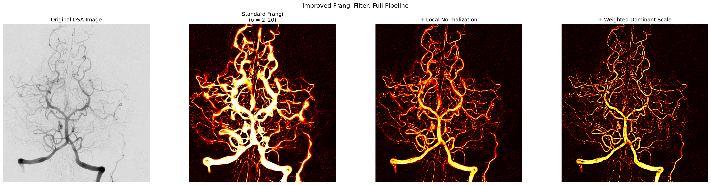
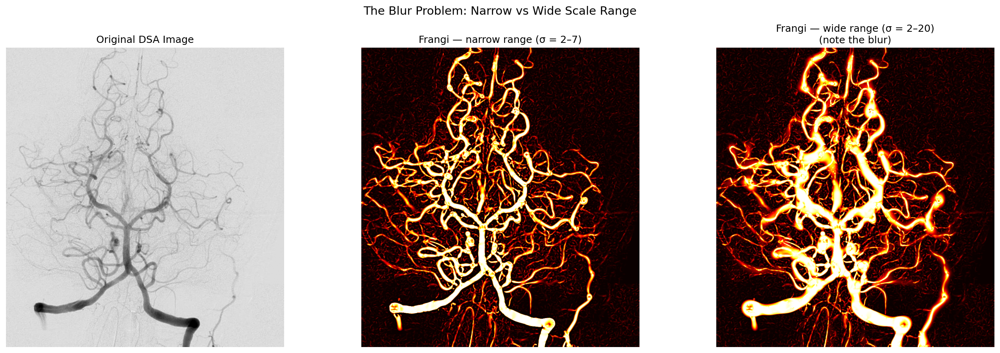
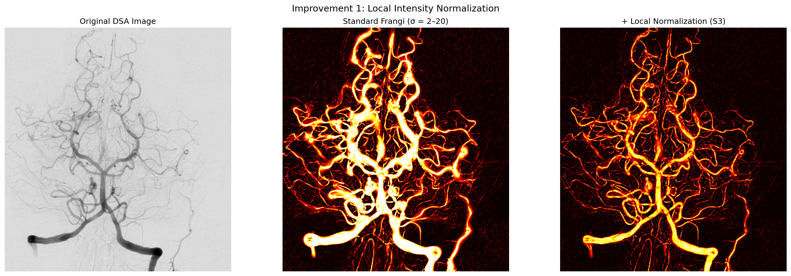
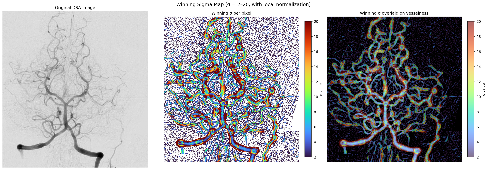
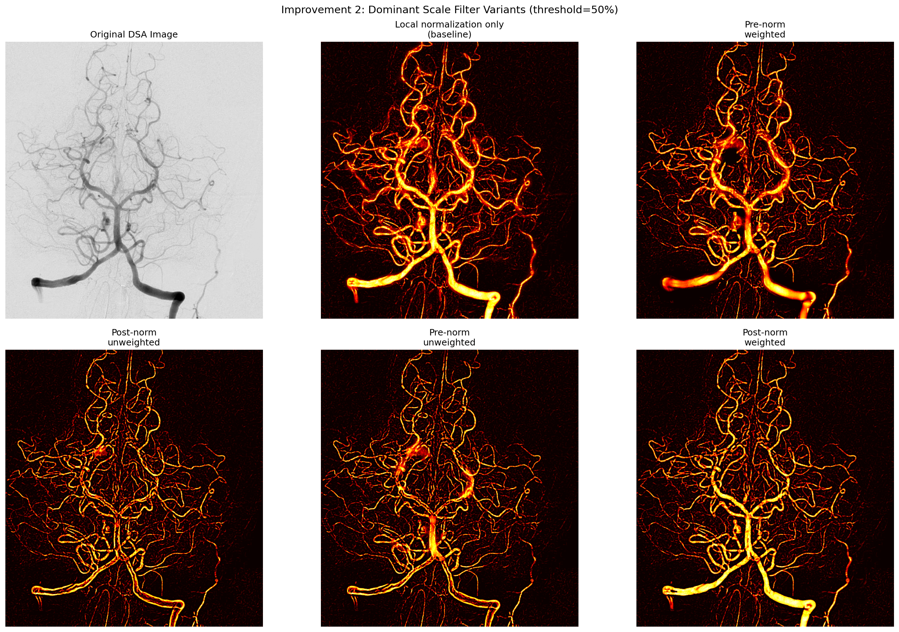
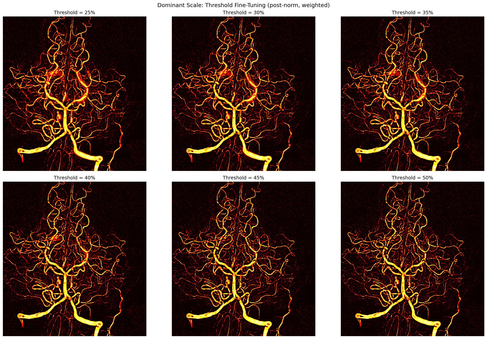

# Improved Frangi Vesselness Filter

Two improvements to the standard [Frangi vesselness filter](https://link.springer.com/chapter/10.1007/BFb0056195) for detecting blood vessels in medical images, specifically Digital Subtraction Angiography (DSA) scans.

1. **Local intensity normalization** (from the [qTICI paper](https://journals.sagepub.com/doi/full/10.1177/1747493020909632)) — suppresses blur caused by the multiscale approach
2. **Weighted dominant scale filtering** (new) — suppresses false responses where clusters of small vessels are mistaken for large ones



## Background

The Frangi filter computes a "vesselness" response at each pixel by analyzing the eigenvalues of the Hessian matrix at multiple Gaussian scales. At every pixel and scale level, the response is:

$$F = e^{-S_1/\beta_1} \cdot (1 - e^{-S_2/\beta_2})$$

Where $S_1 = (\lambda_1/\lambda_2)^2$ measures blobness (low = tube-like) and $S_2 = \lambda_1^2 + \lambda_2^2$ measures structureness (high = not background). The final response per pixel is the maximum across all scales.

### The blur problem

Using a wide range of scales is necessary when an image contains both large and small vessels. However, at large scales the Gaussian kernel is wide, so the Hessian responds to pixels *near* a vessel, not just *on* it. Since the final response takes the maximum across scales, these false large-scale responses win out, creating a blur around vessels.

Narrowing the scale range fixes the blur but sacrifices detection of vessels outside that range — you can't have both with the standard filter.



## Improvement 1: Local Intensity Normalization

From the [qTICI paper](https://journals.sagepub.com/doi/full/10.1177/1747493020909632) (Prasetya, Ramos, Epema, Marquering et al.), a third factor is multiplied into the Frangi response:

$$S_3 = \frac{I - I_{min}}{I_{max} - I_{min}}$$

Where $I$ is the pixel intensity and $I_{max}$, $I_{min}$ are the max/min intensities in a local neighborhood matching the kernel size at that scale. For dark vessels on bright background, this is inverted: $S_3 = (I_{max} - I) / (I_{max} - I_{min})$.

**Why it works:** A pixel on a vessel is bright (or dark) relative to its neighbors, so $S_3 \approx 1$. A pixel merely *near* a vessel has a weaker relative intensity, so $S_3 \ll 1$, suppressing the false response.



### How it looks at different scales

The intermediate results show how each component behaves at small (σ=2), medium (σ=7), and large (σ=20) scales:


## Improvement 2: Weighted Dominant Scale Filtering

After local normalization, some blur remains where many small vessels cluster together — the large-scale Hessian sees the cluster as one big structure. To address this, we introduce a **dominant scale filter**:

1. Run the Frangi filter at all scales as usual, recording which scale gave the maximum response at each pixel
2. Slide a large analysis window (sized to the largest kernel) across the image
3. Within each window, compute a **weighted histogram** of winning scales — each pixel's vote is weighted by its response strength, so strong vessel pixels count more than weak background pixels
4. Suppress scales that fall below a threshold fraction (default 50%) of the dominant scale's weight
5. Apply the restriction to the center portion of the window (sized to the smallest kernel) to avoid boundary artifacts

This enforces local consensus on which vessel sizes are actually present, preventing isolated large-scale false responses from surviving.

### Why weighted votes matter

Without weighting, the edges of a large vessel (which respond to small scales) outnumber the center pixels (which need large scales), causing large vessels to become "hollow." Weighting by response strength ensures the strong center response of a large vessel carries enough weight to keep its scale alive.



### Choosing the best variant

We tested four combinations — weighted vs unweighted votes, and determining dominant scales from pre- vs post-normalization responses. Weighted post-normalization gave the best results:



### Threshold tuning

The threshold controls how aggressive the scale filtering is. After testing values from 25% to 50%, we found 50% to be the sweet spot — the first value with no visible blur and no visible drawbacks:



## Final Result

The full pipeline — standard Frangi → local normalization → weighted dominant scale:


## Interactive Demo

Try the filter in your browser — no installation needed: **[Live Demo](https://carefulCamel61097.github.io/improved-frangi-filter/)**

Upload any angiography image and see the standard Frangi, + local normalization, and + weighted dominant scale results side by side.

## Usage

```python
from frangi_filter import frangi_2d

# Standard Frangi filter
result = frangi_2d(image, sigma_range=(2, 20), bright_on_dark=False)

# + Local normalization (Improvement 1)
result = frangi_2d(image, sigma_range=(2, 20), bright_on_dark=False,
                   local_normalization=True)

# + Weighted dominant scale (Improvement 2)
result = frangi_2d(image, sigma_range=(2, 20), bright_on_dark=False,
                   local_normalization=True,
                   dominant_scale=True,
                   dominant_scale_weighted=True)
```

### Parameters

| Parameter | Default | Description |
|---|---|---|
| `sigma_range` | `(2, 7)` | Min/max sigma for the Gaussian scale levels |
| `beta1` | `0.5` | Correction constant for the blobness factor |
| `beta2` | `15.0` | Correction constant for the structureness factor |
| `bright_on_dark` | `True` | Set `False` for dark vessels on bright background |
| `local_normalization` | `False` | Enable S3 local intensity normalization |
| `dominant_scale` | `False` | Enable dominant scale filtering |
| `dominant_scale_weighted` | `False` | Weight sigma votes by response strength |
| `dominant_scale_threshold` | `0.5` | Fraction (0-1) below which scales are suppressed |
| `dominant_scale_inner` | `None` | Inner window size (defaults to smallest kernel) |

## Reproducing the Figures

```bash
pip install -r requirements.txt
python generate_figures.py
```

Figures are saved to `figures/`.

The sample DSA image is from [Wikimedia Commons](https://commons.wikimedia.org/wiki/File:Cerebral_angiography,_arteria_vertebralis_sinister_injection.JPG) (public domain).

## References

- Frangi, A.F. et al. (1998). *Multiscale vessel enhancement filtering.* MICCAI. [doi:10.1007/BFb0056195](https://link.springer.com/chapter/10.1007/BFb0056195)
- Prasetya, H., Ramos, L.A., Epema, T. et al. (2021). *qTICI: Quantitative assessment of brain tissue reperfusion on digital subtraction angiograms of acute ischemic stroke patients.* International Journal of Stroke, 16(2), 207-216. [doi:10.1177/1747493020909632](https://journals.sagepub.com/doi/full/10.1177/1747493020909632)

## License

MIT
